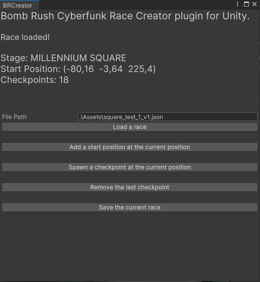

# BRCreator

A tool that i made to help me make checkpoint for the upcoming race mode in the game "Bomb Rush Cyberfunk" with the netplay mode [SlopCrew](https://github.com/SlopCrew/SlopCrew)

This repository come with 2 plugins :

## BRCreator editor plugin

This Unity plugin let you:

- load a race config
- add/remove checkpoint (basically collider) on the scene
- export the result to be used in the upcoming [SlopCrew 1.5.0](https://github.com/SlopCrew/SlopCrew/milestone/2) version

you can look at [SlopCrew race-config](https://github.com/SlopCrew/race-config) to see how a race config look.

To use, assuming you have used [AssetRiper](https://github.com/AssetRipper/AssetRipper) to extract game assets, you will need to :

- open the approriate Scene (aka the stage) in Unity
- download and copy the Assets\Editor content in your Assets\Editor ripped project.

Unity should compile and prompt you this window:

  

⚠ You will have to remove all the decompiled code to get rid of unity compilation error and be able to compile the plugin editor ⚠

- create a basic config file or load an existing
- use the Load button on the editor to load the conf

## BRCreator Race plugin

This plugin is mainly for testing a race conf as it will let you load a conf and start a solo race.

To use:

- Build the mod

The Plugin project references DLLs in your game install. Set `BRCPath` as a global environment variable (depending of the IDE) to something like `F:\games\steam\steamapps\common\BombRushCyberfunk` _without a trailing slash_ and compile the plugin.

- copy one race config to the plugin built in your BepInEx plugins directory (a `BRCreatorRacePlugin` directory should had been created)

- open the game and load a save
- press F5 to start the race and check if the pin/ui indicator match the collider added/modified in unity

## Disclaimer

This is all basic stuff i made to help me with the process of creating race.
This can surely be improved.
Don't hesitate to do some PR that add/fix feature or even just make a better tool if you want
